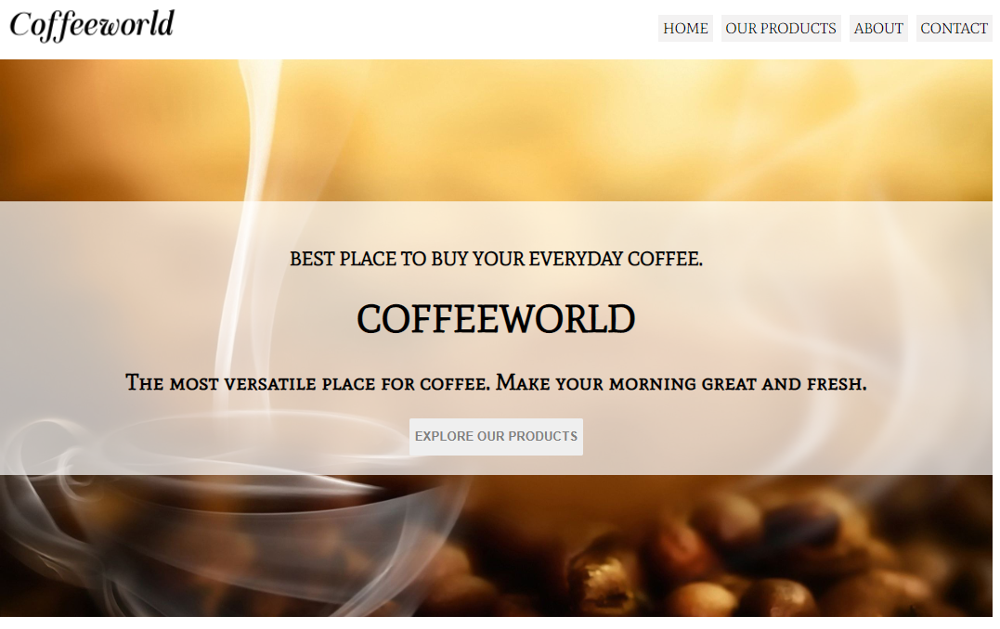

# Coffeeworld_scss

This is a simple scss project to create a template for a coffeeshop. This template is entirely made with html and scss. One of the main aim of this project was to build this theme entirely using scss rather than conventional css.

</h1>Additional description about the project and its features.</h1>

<h2>Built With</h2>

Html

SCSS

<h2>Live Demo</h2>

[coffeeworld](https://coffeeworld-457.netlify.app/)

<h2>Getting Started</h2>
To get a local copy up and running follow these simple example steps.

Clone the repository and get the files in your local branch. Use it according
to your convenience.

Prerequisites
Text editor,Github profile and Git.

<h2>Authors</h2>

👤 Author1

Github: @ajkacca457

Twitter: @ajkacca

Linkedin: https://www.linkedin.com/in/avijit-karmaker-8738a54a/

<h2> 🤝Contribution</h2>
Contributions, issues and feature requests are welcome!

Feel free to check the issues page.

Show your support
Give a ⭐️ if you like this project!

 <h2>📝License</h2>
This project is a personal project of Avijit.
